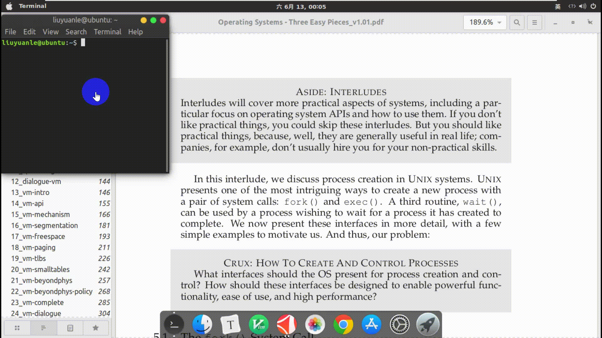

---

欢迎分享，转载务必注明来源！

(https://yuanlehome.github.io/20200612/)

---

这里将要介绍的是一种在 *Linux* 平台实现的划词翻译工具，当然在考虑自己实现一个如此功能的工具前，本人也是在网上搜索了一些在 *Linux* 平台实现的类似的开源工具，例如 [pdfTranslator](https://github.com/axipo/pdfTranslator)，[popup-dict](https://github.com/bianjp/popup-dict)，但它们的安装和配置都显得比较麻烦，而且使用起来也并不方便。

本人实现这个工具的初衷本是方便自己看一些英文文献和书籍的，极为方便，考虑到分享出去可以让更多人受惠，因此这里详细介绍一下它的实现步骤。

<!--more-->

本文所实现的划词翻译工具主要有以下特性：

* 支持英文单词和短语到中文的翻译
* 划词翻译，终端显示
* 自动过滤选中文本中的换行等特殊字符
* 只依赖少数几个 *Linux* 命令工具

下面有动图进行演示。



本人所使用的环境是运行在 *VMware* 虚拟机下的 *Linux* 发行版 *Ubuntu 18.04.3 LTS* ，因此这里介绍的步骤可能与其他 *Linux* 发行版中的实现略有不同。下面就来一步一步的实现它吧。


#####  一. 安装必要的命令

1.  *xclip*

```shell
$ sudo apt install xclip
```

*xclip* 命令建立了终端和剪切板之间通道，可以用命令的方式将终端输出或文件的内容保存到剪切板中，也可以将剪切板的内容输出到终端或文件。详细的用法可以使用 *man xclip*，见其手册。这里介绍几个常用的用法。

```shell
$ xclip file_name # 文件内容保存到X window剪切板
$ xclip -selection c file_name #文件内容保存到外部剪切板
$ xclip -o # X window剪切板内容输出到终端显示
$ xclip -selection c -o # 外部剪切板内容输出到终端显示
```

值得强调的是，这里所说的 *X window* 剪切板，简单的说就是你用鼠标选择的文本会实时的存放在这个剪切板，使用鼠标中键可以粘贴。而外部剪切板是保存你用 *ctrl+c* 复制的文本，*ctrl+v* 可以粘贴。这两个地方是不一样的。

2.  *translate-shell*

```shell
$ sudo apt install translate-shell
```

这是命令行版的谷歌翻译工具，之前叫做 *Google Translate CLI* 是一款借助谷歌翻译（默认）、必应翻译等来翻译的命令行翻译器。它让你可以在终端访问这些翻译引擎。 *translate-shell* 在大多数 *Linux* 发行版中都能使用。常用的方法如下：

```shell
$ trans en:zh [word] # 英文到中文的单词翻译
$ trans en:zh -b [text] # 简要的输出，进行文本翻译
```

需要注意的是，使用这个翻译工具需要你能够**访问外网**，或者通过修改 *translate-shell* 的默认翻译引擎，具体的方法这里就不阐述了。

##### 二. 编程实现

这个工具整体的思路就是 *C* 程序实时检测鼠标按键的动态，当检测到用户使用鼠标选择一段文本之后，调用 *shell* 脚本获取 *X window* 剪切板的内容进行翻译后输出到终端显示。

**1. 定位鼠标设备文件**

鼠标作为输入设备。其信息可以在文件 */proc/bus/input/devices* 中，使用下列命令查看：

```shell
$ sudo cat /proc/bus/input/devices
I: Bus=0011 Vendor=0002 Product=0013 Version=0006
N: Name="VirtualPS/2 VMware VMMouse"
P: Phys=isa0060/serio1/input1
S: Sysfs=/devices/platform/i8042/serio1/input/input4
U: Uniq=
H: Handlers=mouse0 event2 
B: PROP=0
B: EV=b
B: KEY=70000 0 0 0 0
B: ABS=3
```

其中的 *Handlers* 的值 *event2* 表示可以在 */dev/input/event2* 文件下读取鼠标的状态。需要注意的是，对于不同的设备，读取鼠标的状态的文件可能不一样，比如也可能是 */dev/input/event3*。我们可以使用下面的命令找到你的鼠标对应的是哪一个 *event*。

```shell
$ sudo cat /dev/input/event2 | hexdump # 测试时改变数字即可
```

比如，当我运行上面这条命令之后，我移动鼠标、按鼠标左键/中键/右键，终端都会输出一些值，这就说明 *event2* 文件就是对应着我的鼠标。如果操作鼠标没有反应，说明这个就不是。你可以通过这种方法找到你的鼠标对应的 *event* 文件。

**2. Linux 下获取按键响应**

在 *Linux* 内核中，*input* 设备用 *input_dev* 结构体描述，使用 *input* 子系统实现输入设备驱动的时候，驱动的核心工作就是向系统报告按键、触摸屏、键盘、鼠标等输入事件（*event*，通过 *input_event* 结构体描述），不再需要关心文件操作接口，因为 *input* 子系统已经完成了文件操作接口 *Linux/input.h* 这个文件定义了 *event* 事件的结构体，*API* 和标准按键的编码等。

```c
// 结构体定义见 input.h
struct input_event { 
  struct timeval time; // 按键时间 
  __u16 type; // 事件类型 
  __u16 code; // 要模拟成什么按键 
  __s32 value; // 是按下还是释放 
}; 

// 下面宏定义见 input-event-coses.h
// type
#define EV_KEY			0x01
#define EV_REL			0x02
#define EV_ABS			0x03
// ...

// code
#define BTN_LEFT		0x110
#define BTN_RIGHT		0x111
#define BTN_MIDDLE		0x112
// ...

// value
#define MSC_SERIAL		0x00
#define MSC_PULSELED	0x01
// ...
```

这里稍微介绍一下 *type*，指事件类型，常见的事件类型有： 
*EV_KEY*，按键事件，如键盘的按键（按下哪个键），鼠标的左键右键（是否击下）等； 
*EV_REL*，相对坐标，主要是指鼠标的移动事件（相对位移）； 
*EV_ABS*， 绝对坐标，主要指触摸屏的移动事件 。

**3. 编写 *C* 程序**

下面就可以编写程序来检测鼠标的动态了。首先在你的用户~目录下建立文件夹 *Translator*。在 *Translator* 里建立一个 *ct.c* 源文件，代码如下：

```c
#include <stdio.h>
#include <stdlib.h>
#include <unistd.h>
#include <linux/input.h>
#include <fcntl.h>

int main(void)
{
    int keys_fd;
    struct input_event t;
    
    // 注意这里打开的文件根据你自己的设备情况作相应的改变
    keys_fd = open("/dev/input/event2", O_RDONLY);
    if(keys_fd <= 0)
    {
        printf("open /dev/input/event2 error!\n");
        return -1;
    }
    
    while(1)
    {
        read(keys_fd, &t, sizeof(t));
        if(t.type == EV_KEY) // 有键按下
            if(t.code == BTN_LEFT) // 鼠标左键
				if(t.value == MSC_SERIAL) // 松开
                    // 调用外部shell脚本
					system("~/Translator/goTranslate.sh");
    }
    close(keys_fd);
    return 0;
}
```

然后就是调用 *gcc* 编译器生成可执行文件 *ct*：

```shell
$ gcc ct.c -o ct
```

**4. 编写 *shell* 脚本翻译剪切板内容**

在 *Translator* 里建立 *goTranslate.sh* 文件，内容如下：

```shell
#!/bin/bash

str_old=$(cat ~/Translator/lastContent)
str_new=$(xclip -o 2>/dev/null | xargs)
if [[ "$str_new" != "$str_old" && $str_new ]]; then
	echo -e "\n"
	count=$(echo "$str_new" | wc -w)
	if [ "$count" == "1" ]; then
        echo -n -e "$str_new " >> ~/Translator/words
		echo "$str_new" | trans :zh-CN | tail -1 | cut -c 5- | sed "s,\x1b\[[0-9;]*[a-zA-Z],,g" | tee -a ~/Translator/words
	else
		echo "$str_new" | trans :zh-CN -b
	fi
    echo "$str_new" > ~/Translator/lastContent
    
    # 打印分割线
    col=$(cat ~/Translator/TerminalCOLUMNS)
	echo -e -n "\n"
	n=1
	while [ $n -le $col ]
	do
		echo -n "="
		n=$(( n + 1 ))
	done
fi
```

原理非常简单，读者自行了解。这里我们还要在 *Translator* 里建立一个 *lastContent.txt* 文件作为缓存，目的是本次调用脚本时能够获取上一次调用时翻译的文本内容，如果和本次调用的翻译文本一样，则本次就不进行翻译。

**5. 设置 *ct* 别名 **

这里已经可以通过下面的命令运行程序了：

```shell
$ sudo ~/Translator/ct
```

但是由于每次运行都要输出这么长的命令，因此我们在 *~/.bashrc* 文件中加入下面一条命令。

```shell
alias ct='sudo ~/Translator/ct'
```

这样，以后每次看英文文献时就可以在命令行下输入：

```shell
$ ct
```


##### 三. 结束语

这里有一些小技巧。可以更方便的使用这个工具。比如，把终端设为置顶并缩小到合适的尺寸，这样在阅读文献划词翻译时终端屏幕不会遮挡我们的视线。

值得说明的是，由于本人完全是为了方便自己的使用，而且在搞出这么个工具时仅仅接触 *Linux* 系统才不到两周，所以里面的实现对于有经验的朋友来说略显的有些笨拙了，请理解哈。

个人觉得这个工具使用起来还是很方便的，你觉得呢？


参考文章：

1. https://blog.csdn.net/liang12360640/article/details/50350648
2. https://www.cnblogs.com/yangwindsor/articles/3454955.html
3. https://blog.csdn.net/liang12360640/article/details/50s350648

